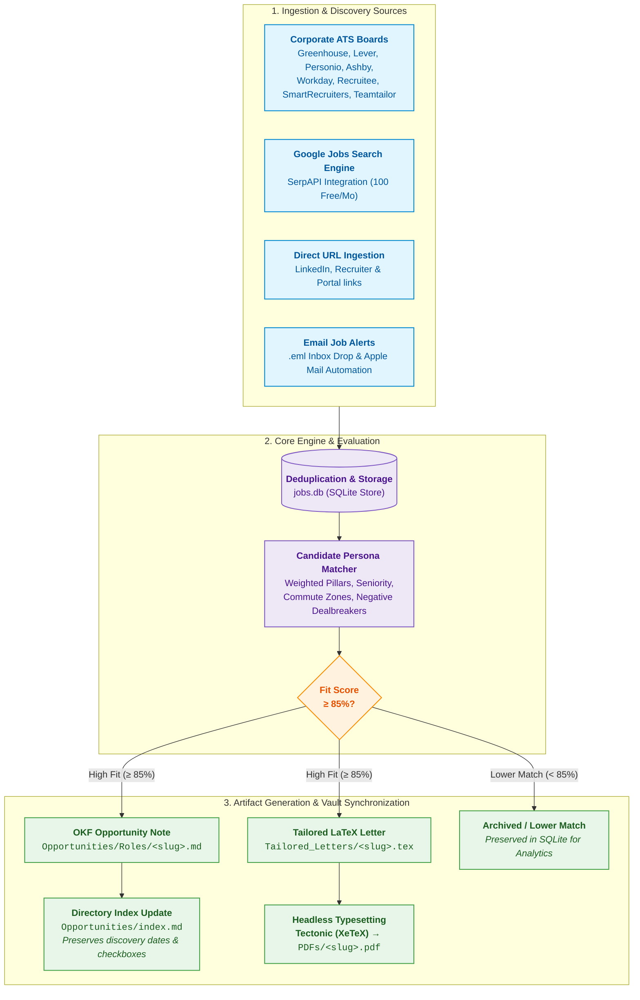

# Autonomous Career Pipeline & ATS Job Matcher

[](LICENSE)
[](https://www.python.org/downloads/)
[]()
[](https://tectonic-typesetting.github.io/)
[](https://github.com/GoogleCloudPlatform/open-knowledge-format)

A cross-platform, privacy-first career agent and autonomous job discovery pipeline. Scans corporate ATS boards, queries live search engines (Google Jobs / SerpAPI), evaluates postings against a configurable candidate persona, generates tailored LaTeX cover letters, and headlessly compiles production-ready PDFs via Tectonic.

Designed to operate either **completely standalone** (CLI / local Markdown) or integrated via a custom link with personal knowledge bases such as an **Obsidian** vault conforming to Google Open Knowledge Format (OKF) v0.2.

---

## Architecture & Data Flow

The pipeline enforces strict separation between the public codebase and your private personal profile, target companies, notes, and cover letter artifacts:



---

## Key Capabilities

* **Multi-ATS Discovery:** Direct REST/JSON connectors for Greenhouse, Lever, Personio, Ashby, Workday, Recruitee, Teamtailor, SmartRecruiters, plus schema.org web harvesting and Google Jobs.
* **Persona-Based Matching:** Weighted rule-based evaluation engine scoring postings across core technical pillars, seniority level, commute/remote preferences, and negative dealbreaker keywords.
* **Overleaf-Ready Cover Letters:** Jinja2-powered LaTeX generation with sanitized typography, standard metric geometry, and automated headless compilation via **Tectonic**.
* **Zero PII Spillage:** The repository contains zero hardcoded candidate identity, contact details, mentors, or private institutions. All personal narratives and location filters are loaded dynamically at runtime.
* **Obsidian Vault Integration:** Dedicated OKF v0.2 adapter connecting seamlessly with an Obsidian second brain via `--vault-path`. Automatically categorizes high-fit roles under `Opportunities/Roles/` and updates the root `index.md` while preserving original discovery dates and applied state.
* **Cross-Platform by Design:** Native support for Windows (PowerShell), macOS (Zsh/Bash), and Linux with UTF-8 safety, POSIX path normalization, and Windows filename sanitation.

---

## Prerequisites & Installation

### 1. Requirements
* **Python 3.10+**
* **[uv](https://docs.astral.sh/uv/)** (recommended for zero-setup execution)
* **[Tectonic](https://tectonic-typesetting.github.io/)** (modern XeTeX engine with automatic package caching)
  * **macOS:** `brew install tectonic`
  * **Windows:** `winget install tectonic` or `cargo install tectonic`
  * **Linux:** `sudo apt install tectonic` or binary download

### 2. Clone the Repository
```bash
git clone https://github.com/noli/career-pipeline.git
cd career-pipeline
```

---

## SerpAPI Integration (Free Tier Setup)

The pipeline integrates with **SerpAPI** to search the live Google Jobs index across portals like LinkedIn, StepStone, Indeed, Xing, and direct company careers sites using tailored boolean queries (configured in `target_companies.json`).

> [!TIP]
> **SerpAPI provides a generous Free Tier of 100 searches per month with zero credit card required.** This is more than sufficient for weekly or daily targeted ecosystem scans.

### How to obtain and configure your free API key:
1. **Create an account:** Register for a free account at [serpapi.com/users/sign_up](https://serpapi.com/users/sign_up).
2. **Copy your API Key:** Navigate to your SerpAPI Dashboard at [serpapi.com/manage-api-key](https://serpapi.com/manage-api-key) and copy your private key.
3. **Configure the pipeline:**
   Copy the example environment file:
   ```bash
   cp .env.example .env
   ```
   Open `.env` and paste your key:
   ```bash
   SERPAPI_API_KEY=<YOUR_SERPAPI_KEY>
   ```
   *(Alternatively, export it in your shell: `export SERPAPI_API_KEY=<YOUR_SERPAPI_KEY>`)*

When enabled, running `career-pipeline --all` automatically executes live Google Jobs searches using your `ecosystem_queries` and ingests matching roles into your database.

---

## Usage & CLI Reference

All commands run directly using `uv` (or global `career-pipeline` executable):

```bash
uv run career-pipeline [OPTIONS]
```

### Command Reference

| Command / Option | Description |
| :--- | :--- |
| `career-pipeline --all` | Runs full automated pipeline: scrapes ATS boards, runs SerpAPI search, ingests inbox emails, scores new roles, and generates letters for high matches. |
| `career-pipeline --stats` | Displays live database metrics: total tracked jobs, high-affinity matches, companies monitored, and ATS coverage. |
| `career-pipeline --url "<URL>" --company "<NAME>"` | Ingests an arbitrary job posting (LinkedIn, StepStone, recruiter link), extracts details, scores it, and generates letter if &ge; 85%. |
| `career-pipeline --inbox` | Parses `.eml` and `.msg` alert files in `Career/Inbox/`, extracts positions, scores them, and moves processed files to `Archive/`. |
| `career-pipeline --sync-mail` | *(macOS only)* Queries Apple Mail for matching alerts, exports them to the inbox directory, and triggers the ingestion pipeline. |
| `career-pipeline --vault-path "<PATH>"` | Overrides the target Obsidian vault directory (defaults to `CAREER_VAULT_PATH` in `.env`). |
| `career-pipeline --threshold <INT>` | Overrides the high-fit threshold percentage (default: `85`). |
| `career-pipeline --no-compile` | Generates LaTeX cover letter sources without running the Tectonic PDF compiler. |

---

## Obsidian Vault Integration

When linked to your private Obsidian vault (or Google OKF v0.2 knowledge base):

1. **Configure your vault location:**
   Set in `.env`:
   ```bash
   CAREER_VAULT_PATH="/path/to/your-vault/Career"
   ```
   Or pass dynamically via `--vault-path "/path/to/your-vault/Career"`.

2. **Directory Structure Mapping:**
   ```
   your-vault/Career/
   ├── Profile.md                # Reads private persona & contact info
   ├── Preferences.md            # Reads target locations & dealbreakers
   ├── Data/
   │   ├── jobs.db               # Persistent SQLite database
   │   ├── target_companies.json # Monitored ATS boards & queries
   │   └── digest.md             # Summary digest of active opportunities
   ├── Inbox/                    # Raw .eml email alerts dropzone
   ├── Opportunities/
   │   ├── index.md              # Root index listing roles & applied checkboxes
   │   └── Roles/
   │       └── <company>-<title>.md  # Full role notes with score breakdown
   ├── Tailored_Letters/
   │   └── <company>_<title>.tex # Parameterized LaTeX cover letter
   └── PDFs/
       └── <company>_<title>.pdf # Production-ready compiled PDF
   ```

3. **Application Checkbox Preservation:**
   When you mark a role as applied in `Career/Opportunities/index.md` (e.g. `- [x] Applied (2026-09-18)`), subsequent runs will **never overwrite** your checkbox or application date.

---

## Cross-Platform Quick Runners

Native convenience scripts are provided for all major operating systems:

* **macOS / Linux (Bash):**
  ```bash
  chmod +x run_pipeline.sh
  ./run_pipeline.sh --all
  ```
* **Windows (PowerShell):**
  ```powershell
  .\run_pipeline.ps1 -all
  ```

---

## Agent Skill Installation (Antigravity / Gemini / Claude)

A standardized agent skill definition is included in `templates/skills/career-job-search/SKILL.md`.

To enable autonomous agent control over this pipeline in your agentic workspace:

### Workspace-Level Installation (Recommended)
Copy the skill folder into your workspace root:
```bash
mkdir -p "/path/to/your-vault/.agents/skills/career-job-search"
cp templates/skills/career-job-search/SKILL.md "/path/to/your-vault/.agents/skills/career-job-search/SKILL.md"
```

### Global Installation
Copy the skill into your global customizations directory:
```bash
mkdir -p "$HOME/.gemini/config/skills/career-job-search"
cp templates/skills/career-job-search/SKILL.md "$HOME/.gemini/config/skills/career-job-search/SKILL.md"
```

---

## Verification & Testing

The repository includes a comprehensive test suite that validates cross-platform file operations, matching algorithms, and verifies that zero personal data or hardcoded credentials exist:

```bash
# Run all unit tests
python3 -m unittest discover tests
```

---

## License

[MIT License](LICENSE). Free for personal and commercial adaptation.
